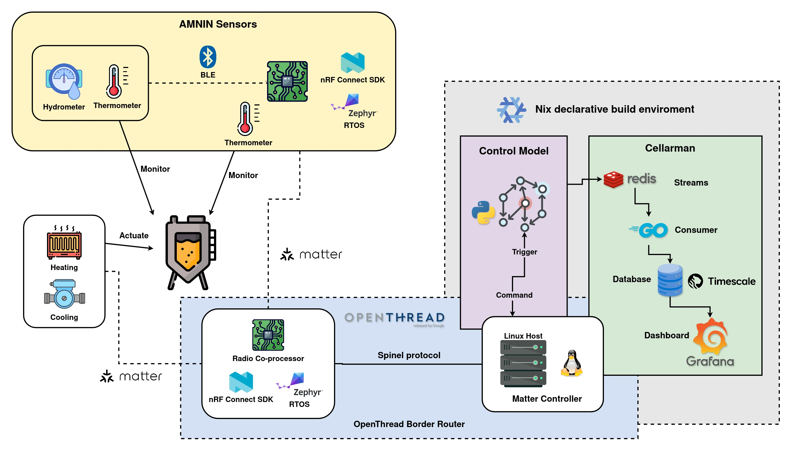
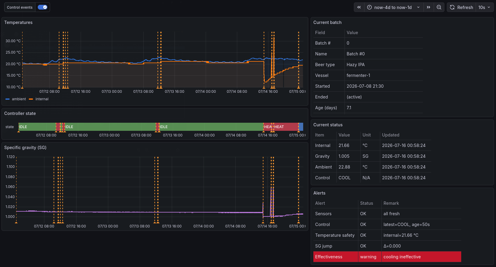
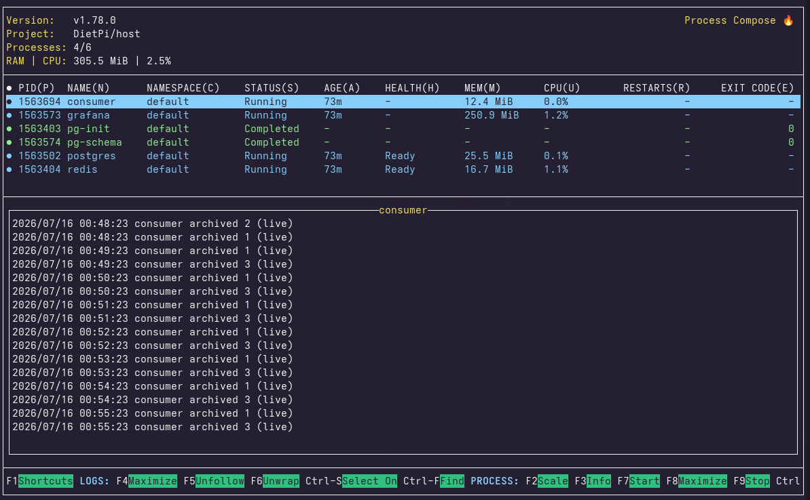

# BuranBrew
BuranBrew is a **fully automated microbrewery platform** that provides the
services needed to monitor, analyze, and control the beer fermentation process.

## Introduction

BuranBrew is a cyber-physical distributed system composed of the following
subsystems:

### AMNIN Sensors
"**AM**bient '**N** **IN**ternal Sensors" is a Zephyr firmware application for
the nRF54L15 Tag. The device acts as a Matter bridge, exposing data from a BLE
Tilt Hydrometer/Thermometer to the Matter network. It also performs sensor
fusion by combining the Tilt measurements with its onboard ambient temperature
reading.

### Control Model
A Python computational model that takes the sensor data as input, determines
the best action, then sends commands to the actuator.

### Cellarman
A telemetry stack consisting of Redis Streams, a Go consumer, TimescaleDB, and
a Grafana dashboard server. It decouples data storage and analytics from
physical process control, ensuring that fermentation control will not be
interrupted if the telemetry server fails. The stack also provides human
operators with a user interface for real-time monitoring and post-mortem
analysis of the fermentation process.

---
In the physical space, the components are glued together with the help of the
OpenThread abstraction layer. In the cyberspace, Nix provides a declarative
development environment that ensures consistent and reproducible builds.

The overall architecture are shown as the diagram below:

### What is Buran
**Buran** was the name of both the Soviet spaceplane program and its orbital
vehicle, which belonged to a classification known as the *Buran-class*
orbiters. The Buran program was the USSR's response to the American Space
Shuttle program during the final decades of the Cold War. Buran made its first
and only spaceflight on November 15 1988. **The mission was completely
uncrewed**. Its fully automatic runway landing was regarded as a remarkable
technical achievement.

Following the dissolution of the USSR in 1991, funding largely disappeared.
The program was formally terminated in 1993.

In this sense, the Buran program can be viewed through Mark Fisher’s concept of
the lost futures: an ambitious vision of progress that disappeared alongside
the political and economic system that created it. It evokes the imagination
of an alternative historical path beyond the capitalist order that ultimately
prevailed after the Cold War.

## Getting Started
This chapter describes how to set up BuranBrew program along with the necessary
hardware components

### BOM
- 1x nRF54L15 tag for AMNIN Sensors
- 1x nRF54L15 DK for Radio Co-Processor (RCP)
- 1x Linux computer for OpenThread Border Router (OTBR), the Control Model, and
  Cellarman. Raspberry Pi with at least 2 GB RAM is recommended.
- 1x BLE senor for AMNIN Sensors. Tilt hydrometer is recommended.
- 2x Matter-over-Thread plugs for actuator. IKEA GRILLPLATS are recommended.

## Installation and Usage
Follow the listed documentation in order:

1. [Workspace Setup](docs/WORKSPACE_SETUP.md).
2. [Build Steps](applications/amnin_sensors/BUILD_STEPS.md).
3. [Host Bring-up & Commision Guide](host/README.md).
4. [Cellarman Operation Guide](host/telemetry/README.md).

### Cellarman real-time monitor
The Grafana server

### Cellarman process orchestrator
The Process Compose tool

## How to Contribute
Anyone can contribute by reporting bugs using GitHub Issues or solving a bug by
raising a PR. If one wants to propose a new idea, please submit a RFC in GitHub
Issues as well so we can align on the direction before spending time on the
implementation.

## Disclaimer
AI assistance has been used in portions of the source code. All code has been
reviewed and/or refactored by a human before being committed.
